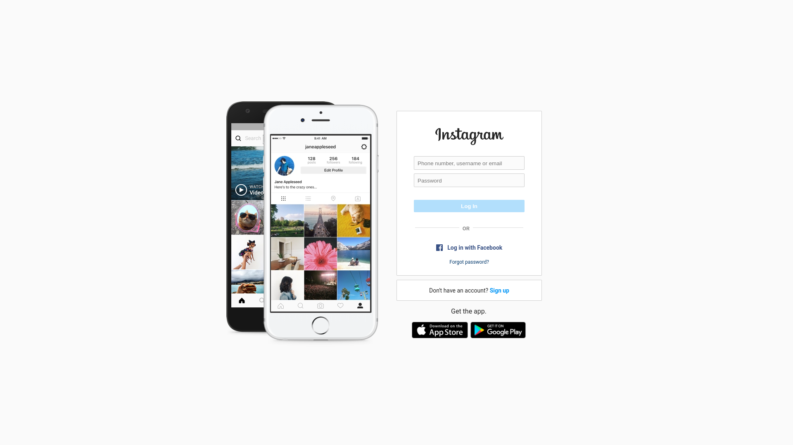
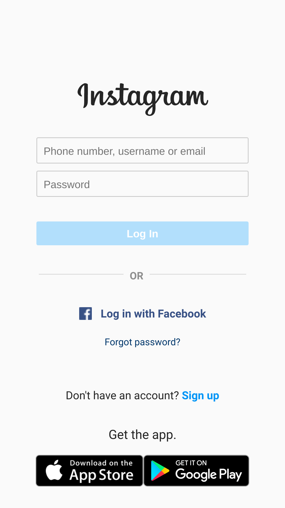

# UI Clone - Instagram 

[Instagram - Login page](https://www.instagram.com/) clone de UI para fins de estudo

### 🗒️ Sobre

O objetivo do projeto foi reconstruir a página de login do Instagram, na qual pratiquei conhecimentos sobre CSS, utilizando Flexbox e Grid, uma metodologia de posicionamento de elementos em tela mais utilizada no mercado assim como conceitos de responsividade. E também utilizando sass que é um dos principais pré-processadores css disponíveis atualmente. 

### 📷 Prévias 

Página principal do clone 

  

Versão mobile do clone

  

### 🔨 Instalação 

1. Abra a pasta do projeto no `VSCode`
2. Instale a extensão `Live Server` e` Live Sass Compiler`
3. Clique com o botão direito em `index.html`>` Open with Live Server`
4. Acesse o ** endereço gerado ** em seu navegador

### 💻 Tecnologias 

 - HTML
 - CSS/SCSS
 
### 🔗 Referências
[Digital Innovation One](https://web.digitalinnovation.one/): Recriando a página inicial do Instagram
Frontend básico - CSS 